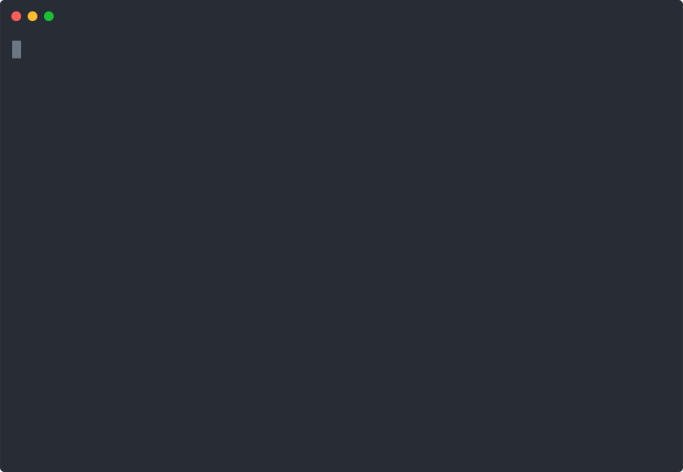

# Graphite user guide

---

**Welcome to the Graphite beta**
Everything is still a little early, so please add comments if you have any questions, feedback, or suggestions!

---



### **Getting started**

Install Graphite using Homebrew ([https://brew.sh/](https://brew.sh/))

```bash
brew install screenplaydev/tap/graphite

cd ~/my-project

# Fix uses the current state of git branches
# to infer parent-child relationships, and
# stores that as metadata in your git repo.
# This metadata is used for future restacks.
git checkout main && gp fix
```

---

### Learn X in Y: Graphite

```bash
# Get your bearings using log:

tomasreimers % gp log
* f1af8f9 - Server changes - Tomas Reimers (HEAD -> **tr--server-changes**)
* d8b1d19 - Second commit - Tomas Reimers (main)
* 7463128 - First commit - Tomas Reimers

# Create changes with diff:

tomasreimers % gp diff -m "Frontend changes" -b **tr--frontend-changes**
Switched to a new branch 'tr--frontend-changes'
tomasreimers % gp log
* 63a8061 - Frontend changes - Tomas Reimers (HEAD -> **tr--frontend-changes**)
* f1af8f9 - Server changes - Tomas Reimers (**tr--server-changes**)
* d8b1d19 - Second commit - Tomas Reimers (**main**)
* 7463128 - First commit - Tomas Reimers

# Update previous branches with amend:

tomasreimers % gp prev
tomasreimers % touch otherfiles
tomasreimers % gp amend -m "Forgot some other files"
tomasreimers % gp log
* ebcfb23 - Frontend changes - Tomas Reimers (**tr--frontend-changes**)
* 93b107a - Forgot some other files - Tomas Reimers (HEAD -> **tr--server-changes**)
* f1af8f9 - Server changes - Tomas Reimers
* d8b1d19 - Second commit - Tomas Reimers (**main**)
* 7463128 - First commit - Tomas Reimers
```

---

### CLI Concepts

Graphite helps users create many small stacking changes which are easier and faster to review than big PRs. This speeds up the workflow for you and your reviewers. [The "stacked diffs" workflow is not new](https://jg.gg/2018/09/29/stacked-diffs-versus-pull-requests/) but is painful on native GitHub.

What is a stack? A stack is a sequence of code changes, each building off of its parent. Stacks enable users to continue coding new branches while peers code review dependent changes. A stack is represented by a sequence of git branches rather than commits because, on GitHub, branches are the smallest discrete unit of CI and code review.

- Graphite works off two views of your stacks - those as described by the current git branch parent-child relations, and the other as described by our metadata parent-child relations.
- The Graphite CLI provides commands to manipulate branches based on these two views.

You can use the CLI alongside any other git tooling, by simply branching branches off of one another and calling `gp fix` to store the relationship as currently exists in your git repository (for example, if you branch B off of A and call fix, Graphite will store that B is a child of A).

Alternatively, creating branches and commits using graphite commands like `diff` and `amend` will ensure that metadata gets updated in step with your git repository.

At any point, you may print out graphite's metadata using `gp stacks`. If there is a divergence between graphite's git-derived and metadata-derived stacks, it will print out both worlds side-by-side.

_Note: All graphite commands except for `restack` operate based on the git-derived stacks. In the case of divergent stack views, you can run:_

- _`restack` to adjust git branches to match the metadata-derived world or_
- _`fix` to align the metadata to match the git-derived world._

Why do we maintain metadata? Git alone cannot reliably track a stack of branches. Git branch can only derive its parent branch when its history contains a commit matching its parent's HEAD. If the parent branch continues forward one commit or is rebased, the child branch loses sight of its parent. In these moments, graphite uses the persisted metadata to remember the DAG of parents and rebase branches appropriately.

Where is the metadata stored? In your repo in the form of refs, visible at `.git/refs/branch-metadata/`. All information stays within git and can be synced to and from remote repositories.

---

### Current CLI Commands (`gp --help`)

**`gp next`**

If you're in a stack: Branch A → Branch B (you are here) → Branch C. Takes you to the next branch (Branch C). If there are two descendent branches, errors out and tells you the various branches you could go to.

**`gp prev`**

If you're in a stack: Branch A → Branch B (you are here) → Branch C. Takes you to the previous branch (Branch A). If there are two ancestral branches, errors out and tells you the various branches you could go to.

**`gp diff`**

Takes the current changes and creates a new branch off of whatever branch you were previously working on.

**`gp amend`**

Given the current changes, adds it to the current branch (identical to git commit) and restacks anything upstream (see below).

**`gp stacks`**

Prints all current stacks.

**`gp log`**

Prints the current state of the world

**`gp fix`**

Trace the current branch through its parents, down to the base branch. Establish dependencies between each branch for later traversal and restacking.

**`gp restack`**

Restacks any dependent branches onto the latest commit in a branch.

**`gp validate`**

Validates that the meta graph matches the current graph of git branches and commits.

**`gp feedback <message>`**

Post a string directly to our Slack where we can factor in your feedback, laugh at your jokes, cry at your insults, or test the bounds of Slack injection attacks.

---

### Graphite web dashboard

Along with the CLI, Graphite includes a [web dashboard](https://app.graphite.dev/) to view your queue of open PRs from GitHub.

Here's how to get started:

- Sign in with GitHub at [https://app.graphite.dev/](https://app.graphite.dev/)
- Select one or more of the repos you most frequently work in
- Graphite will automatically create 2 filtered views including each repo:
  - My pull requests
  - Others' pull requests
- You can add additional filter views with "Add section", re-arrange existing sections by dragging and dropping them, and update or delete a section in "Settings"
- Refresh the dashboard for an up-to-date view of your review queue

---

### Public roadmap

We'd love your feedback on our roadmap for Graphite - please feel free to add comments, share feedback, or send us a request for a new feature or bug fix!
