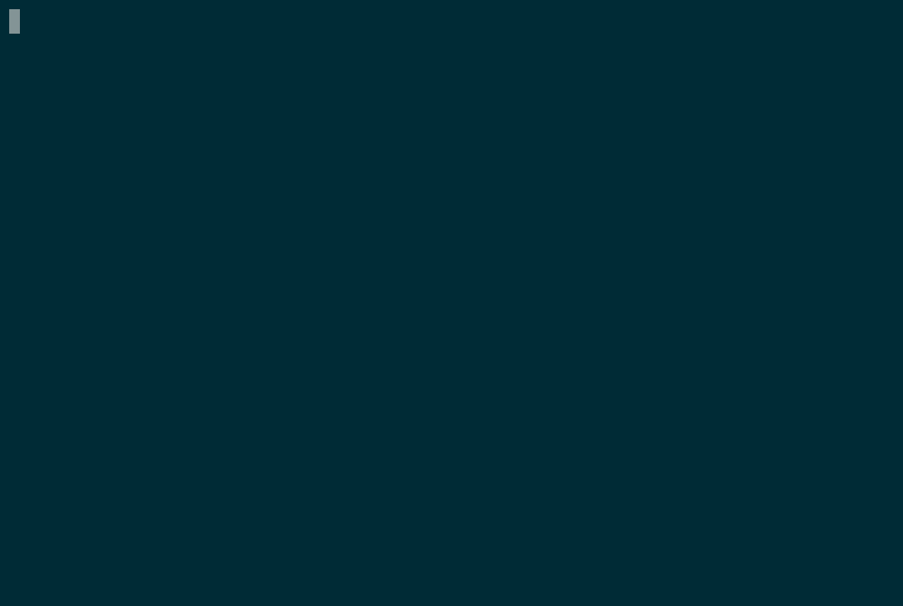

# Graphite user guide

---

**Welcome to the Graphite beta**
Everything is still a little early, so please add comments if you have any questions, feedback, or suggestions!

---



### **Getting started**

Install Graphite using Homebrew ([https://brew.sh/](https://brew.sh/))

```bash
brew install screenplaydev/tap/graphite

cd ~/my-project

# Fix uses the current state of git branches
# to infer parent-child relationships, and
# stores that as metadata in your git repo.
# This metadata is used for future fixes.
git checkout main && gp stack fix
```

---

### CLI Concepts

Graphite helps you create many small stacking changes which are faster and easier to review than big PRs. This results in a better workflow for you and your code reviewers. [The "stacked diffs" workflow is not new](https://jg.gg/2018/09/29/stacked-diffs-versus-pull-requests/) but is painful on native GitHub.

What is a stack? A stack is a sequence of code changes, each building off of its parent. Stacks enable users to continue coding new branches while peers code review dependent changes. A stack is represented by a sequence of git branches rather than commits because, on GitHub, branches are the smallest discrete unit of CI and code review.

- Graphite extends Git's commits and branches with a third unit - stacks.
- A Graphite stack is a chain (DAG) of dependent branches.
- Graphite tracks stacks by recording parent relationships between branches through git refs.

You can use the CLI alongside any other git tooling. If you create a series of dependent branches, simply call `gp stack fix` to regenerate Graphite's stack.

Alternatively, creating branches and commits using graphite commands like `gp branch` and `gp branch --amend` will ensure that your stacks are updated in step with your git repository.

At any point, you may print out graphite's metadata using `gp log`. If there is a divergence between your git branches and stacks, the output will highlight the discrepancy.

### Why track stacks using metadata stored in git refs?

Native git cannot reliably track a stack of branches. A branch can only derive its parent branch when its history contains a commit matching its parent's HEAD. If the parent branch continues forward one commit or is rebased, the child branch loses sight of its parent. In these moments, Graphite uses the persisted metadata to remember the DAG of branches and can rebase them appropriately.

Where is the metadata stored? In your repo in the form of refs, visible at `.git/refs/branch-metadata/`. All information stays within git and can be synced to and from remote repositories.

---

### Current CLI Commands (`gp --help`)

### CLI Commands (`gp --help`)

```bash
# gp stack ...
gp stack fix # rebases git branches to match stack
gp stack regen # create stacks based on the git branches.
gp stack clean # delete branches in the stack which have been merged into stack trunk
gp stack validate # pull changes to pull request and store in stack metadata, such as titles
gp stack submit # [TODO] create pr's / force pushes for full stack
gp stack land # [TODO] attempt to land full stack
gp stack fetch # [TODO] pull changes to pull request and store in stack metadata, such as titles

# gp upstack...
gp upstack onto # move upstack inclusive onto some other branch
gp upstack validate # pull changes to pull request and store in stack metadata, such as titles

# gp downstack...
gp downstack submit # create pr's / force pushes for full stack
gp downupstack validate # pull changes to pull request and store in stack metadata, such as titles
gp downstack land # [TODO] attempt to land full stack

# gp branch ...
gp branch create <name> # Create new stacked branch, commit staged changes changes
gp branch amend # Commit staged changes on top of current branch, fix upstack
gp branch next # Traverse upstack by one branch
gp branch prev # Traverse downstack by one branch
gp branch land # [TODO] If possible, land branch, clean stack, and fix upstack
gp branch submit # [TODO] Create PR / force push current branch
gp branch top # [TODO] Traverse upstack fully
gp branch bottom # [TODO] Traverse downstack fully

# gp userconfig...
gp userconfig auth # [TODO] Opens website, fetches token, prompts user to paste in token

# gp repoconfig...
gp repoconfig # [TODO] print repo config
gp repoconfig --get-owner # print key value # [TODO]
gp repoconfig --set-owner=<value> # set key values # [TODO]
gp repoconfig --set-trunk=<value> # [TODO]
gp repoconfig --set-origin=<value> # [TODO]
```

---

### Graphite web dashboard

Along with the CLI, Graphite includes a [web dashboard](https://app.graphite.dev/) to view your queue of open PRs from GitHub.

Here's how to get started:

- Sign in with GitHub at [https://app.graphite.dev/](https://app.graphite.dev/)
- Select one or more of the repos you most frequently work in
- Graphite will automatically create 2 filtered views including each repo:
  - My pull requests
  - Others' pull requests
- You can add additional filter views with "Add section", re-arrange existing sections by dragging and dropping them, and update or delete a section in "Settings"
- Refresh the dashboard for an up-to-date view of your review queue

---

### Public roadmap

We'd love your feedback on our roadmap for Graphite - please feel free to add comments, share feedback, or send us a request for a new feature or bug fix!
